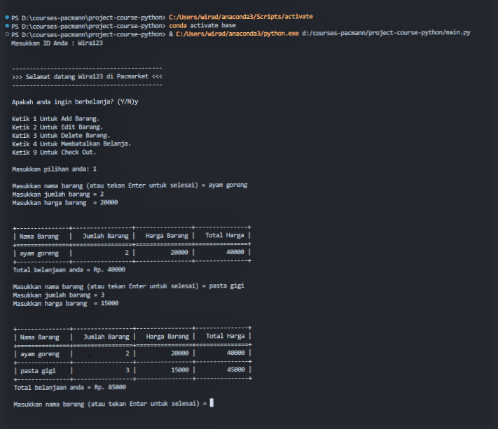
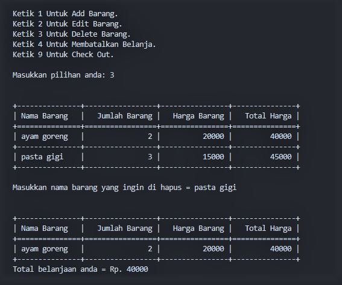
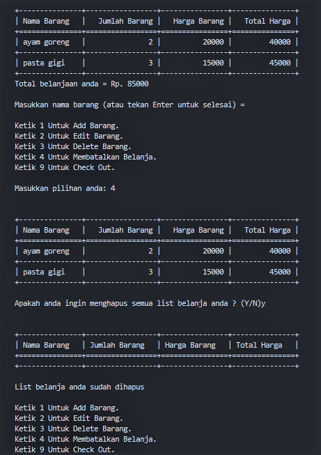
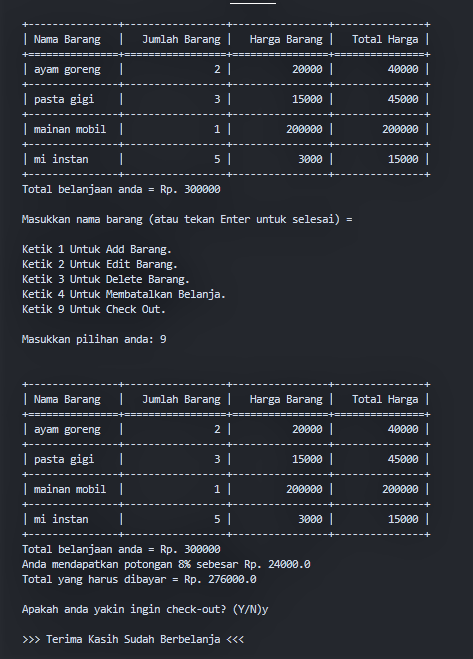

# Introduction
Halo teman-teman, saya adalah seorang siswa yang antusias dari Pacmann, salah satu startup pendidikan terkemuka di Indonesia. Saat ini, saya diberikan tugas project menarik yaitu  mengembangkan program kasir sederhana menggunakan bahasa pemrograman Python. Dalam proyek ini, kita akan memasuki dunia pemrograman dan menggabungkannya dengan kebutuhan sehari-hari dalam mengelola transaksi toko atau minimarket. Bersama Pacmann saya telah memahami konsep dasar pemrograman Python, merancang alur kerja untuk menghitung total belanjaan, mencatat item-item yang dibeli, menghitung diskon dan transaksi lainnya.

# Background Project
Andi adalah seorang pemilik supermarket besar di salah satu kota di Indonesia. Andi memiliki rencana untuk melakukan perbaikan proses bisnis, yaitu Andi akan membuat sistem kasir yang self-service di supermarket miliknya. Sehingga customer bisa langsung memasukkan item yang dibeli, jumlah item yang dibeli, dan harga item yang dibeli dan fitur yang lain.
Sehingga customer yang tidak berada di kota tersebut bisa membeli barang dari supermarket tersebut. Setelah Andi melakukan riset, ternyata Andi memiliki masalah, yaitu Andi membutuhkan Programmer untuk membuatkan fitur-fitur agar bisa sistem kasir self-service di supermarket itu bisa berjalan dengan lancar.

# Objectives
- ID Cust : Pengguna diminta untuk memasukkan ID nya sebagai awal dari proses transaksi yang akan dilakukan.
- Transaksi : Dalam bertransaksi pengguna akan diberikan beberapa pilihan menu belanja diantaranya yaitu :
    - Menambahkan item --> Pengguna dapat memasukkan nama barang yang hendak dibeli, jumlah barang, harga barang dan menampilkan total harga secara otomatis. 
    - Mengedit item --> Pengguna dapat mengedit nama barang yang sudah dimasukkan kedalam list belanja lalu memasukkan nya dengan nama barang yang baru
    - Menghapus item --> Pengguna dapat menghapus salah satu item barang dalam list belanja yang tidak diinginkan.
    - Mereset item --> Pengguna dapat mereset atau menghapus semua item dalam list belanja dan bisa memasukkan iteem-item belanja nya lagi
    - Check-out --> Pengguna akan diberikan diskon dengan ketentuan-ketentuan tertentu dari total belanjaan.

## Tahapan Project
- Flowchart : Sebelum membuat code program biasanya kita mulai dari menggambarkan diagram dari objektif yang sudah kita tentukan sebelumnya
- Membuat Code --> Terdapat beberapa ketentuan dalam pengembangan project ini yaitu :
  -  Fitur : Teridiri dari fungsi-fungsi dimana fungsi tersebut berisi sintak-sintak untuk menjalankan suatu proses.
  -  Modular Code : Memecah masalah menjadi menjadi kelompok masalah yang lebih kecil.
  -  Clean Code (PEP8) : Code yang memiliki struktur yang tertata,, format dan penulisan yang rapih sehingga dapat dipahami dan dibaca dengan mudah.
  -  Document String : Memberikan komentar khusus dalam code Python yang digunakan untuk mendokumentasikan fungsi, kelas, atau modul.
  -  Try - Error : Mencegah program crash dan memberikan penanganan yang sesuai terhadap kesalahan yang mungkin terjadi selama program berjalan.
  -  Library : Pandas membantu pengguna untuk mengimpor, mengelola dan melakukan transformasi data tabular.
- Test Case : melakukan simulasi program yang sudah dibuat
- Kesimpulan

Mari kita mulai dengan mengikuti langkah-langkah tersebut diatas

1. Flowchart --> SOON
2. Membuat code
   - Import library
     ```
     from tabulate import tabulate
     import pandas as pd
     ```
     - from tabulate import tabulate: Ini mengimpor fungsi tabulate dari modul tabulate, yang digunakan untuk membuat tabel dari data Python.
     - import pandas as pd: Ini mengimpor modul pandas dan memberikan alias pd. Modul pandas digunakan untuk analisis dan manipulasi data dalam bentuk kerangka data (data frames). Alias pd memudahkan penggunaan modul ini.
       
    - Class
      ```
      class Pacmarket:
        """
        Class untuk simulasi toko Pacmarket.
        """
      ```
      - class Pacmarket:: Ini adalah deklarasi awal untuk membuat sebuah kelas yang disebut Pacmarket. Kelas adalah sebuah blueprint untuk objek, yang berarti Anda dapat membuat objek-objek yang akan memiliki atribut dan metode yang sama seperti yang didefinisikan dalam kelas ini.
      - """ Class untuk simulasi toko Pacmarket. """: Ini adalah docstring, yang digunakan untuk memberikan dokumentasi atau penjelasan tentang kelas kepada pengembang dan pembaca kode. Dalam hal ini, docstring menjelaskan bahwa kelas Pacmarket digunakan untuk mensimulasikan toko dengan nama Pacmarket. Ini membantu orang lain yang membaca atau bekerja dengan kode untuk memahami tujuan kelas ini.
        
    -  Inisialisasi List Belanja
       ```
        def __init__(self):
            """
            Inisialisasi List Belanja
        
            Parameter
            ---------
            list_belanja = dict
            """
            self.list_belanja = {"Nama Barang": [], "Jumlah Barang": [], "Harga Barang": [], "Total Harga": []}
       ```
       - def __init__(self):: Ini adalah metode khusus dalam Python yang disebut __init__. Metode ini adalah konstruktor, yang berarti dipanggil saat Anda membuat objek dari kelas yang terkait. Dalam kasus ini, itu akan dipanggil saat Anda membuat objek dari kelas yang mengandung metode ini.
       - """ Inisialisasi List Belanja """: Ini adalah docstring yang memberikan penjelasan tentang apa yang dilakukan oleh metode __init__. Metode ini bertujuan untuk menginisialisasi atau membuat objek list_belanja.
       - self.list_belanja = {"Nama Barang": [], "Jumlah Barang": [], "Harga Barang": [], "Total Harga": []}: Ini adalah pernyataan yang menginisialisasi atribut list_belanja dalam objek kelas. Atribut ini adalah sebuah dictionary yang memiliki empat kunci (keys) yang berisi daftar kosong untuk "Nama Barang," "Jumlah Barang," "Harga Barang," dan "Total Harga." Dengan ini, saat kita membuat objek dari kelas ini, objek tersebut akan memiliki atribut list_belanja dengan struktur data yang siap digunakan untuk melacak barang-barang dalam daftar belanja.
   
    - ID Customer
      ```
      def masukkan_id(self):
        """
        Function untuk memasukkan ID Customer 

        Parameters
        ----------
        id_cust : str
            Input ID Customer.
        """
        while True:
            try:
                self.id_cust = input("Masukkan ID Anda : ")
                if not self.id_cust:
                    raise ValueError("ID tidak boleh kosong")
                break
            except ValueError as e:
                print(f"---> Error: {e}")

        pesan = f">>> Selamat datang {self.id_cust} di Pacmarket <<<"
        print("\n")
        print("-" * len(pesan))
        print(pesan)
        print("-" * len(pesan))
      ```
      - def masukkan_id(self): Ini adalah definisi sebuah metode dalam sebuah kelas. Metode ini disebut masukkan_id dan digunakan untuk meminta pengguna memasukkan ID Customer.
      - while True: Ini adalah loop yang berjalan terus-menerus hingga pengguna memasukkan ID yang valid.
      - try: Ini adalah blok percobaan di mana program mencoba menjalankan pernyataan-pernyataan di dalamnya. Pada kasus ini, program mencoba untuk mengambil input ID dari pengguna dengan input("Masukkan ID Anda : ").
      - if not self.id_cust: Ini adalah pernyataan yang memeriksa apakah ID yang dimasukkan oleh pengguna kosong. Jika iya, maka program akan menimbulkan (raise) pengecualian (exception) dengan pesan kesalahan "ID tidak boleh kosong."
      - raise ValueError("ID tidak boleh kosong"): Ini adalah pernyataan yang menimbulkan pengecualian dengan jenis ValueError dan pesan kesalahan yang sesuai jika ID yang dimasukkan oleh pengguna kosong.

    - Menu Belanja
      ```
      def transaksi(self):
        """
        Function untuk melakukan transaksi

        Parameter
        --------

        Menu belanja = int [1,2,3,4,9]
            input menu_belanja
        """
        while True:
            confirm1 = input("\nApakah anda ingin berbelanja? (Y/N)")

            if confirm1.lower() == "n":
                self.selesai()
                break

            while confirm1.lower() == "y":
                print("\nKetik 1 Untuk Add Barang. \nKetik 2 Untuk Edit Barang. \nKetik 3 Untuk Delete Barang. \nKetik 4 Untuk Membatalkan Belanja.\nKetik 9 Untuk Check Out.")
                try:
                    menu_belanja = int(input("\nMasukkan pilihan anda: "))
                    if menu_belanja not in [1, 2, 3, 4, 9, 0]:
                        raise ValueError("Masukkan angka sesuai menu diatas")

                    if menu_belanja == 1:
                        self.tambah_barang()  # Panggil method tambah_barang

                    elif menu_belanja == 2:
                        self.edit_barang()  # Panggil method edit_barang

                    elif menu_belanja == 3:
                        self.hapus_barang()  # Panggil method hapus_barang

                    elif menu_belanja == 4:
                        self.list_belanja = self.reset_barang()  # Panggil method reset_barang

                    elif menu_belanja == 9:
                        self.check_out_barang()  # Panggil method check_out_barang
                        break

                except ValueError as e:
                    print(f"---> Error: {e}")
      ```
      - def transaksi(self):: Ini adalah definisi sebuah metode dalam sebuah kelas. Metode ini disebut transaksi dan digunakan untuk melakukan transaksi berbelanja.
      - Pada awalnya, metode ini meminta konfirmasi dari pengguna apakah ingin berbelanja atau tidak. Jika pengguna memilih untuk tidak berbelanja (confirm1.lower() == "n"), maka metode selesai dipanggil, dan proses berakhir.
      - Jika pengguna memilih untuk berbelanja (confirm1.lower() == "y"), maka akan ada loop berjalan yang memungkinkan pengguna untuk memilih menu berbelanja (1 untuk menambah barang, 2 untuk mengedit, 3 untuk menghapus, 4 untuk membatalkan belanja, dan 9 untuk check out).
      - Terdapat penanganan pengecualian (try-except) untuk mengatasi kesalahan saat pengguna memasukkan input yang tidak sesuai, seperti bukan angka yang valid atau angka di luar pilihan menu yang tersedia.
      - Terdapat pemanggilan metode-metode lain seperti tambah_barang, edit_barang, hapus_barang, reset_barang, dan check_out_barang sesuai dengan pilihan yang dibuat oleh pengguna.
         
    - Cek Dictionary
      ```
      def cek_dict(self):
        """
        Function untuk mengecek data dalam Dictionary
        """
        if not self.list_belanja["Nama Barang"]:
            print("\n")
            print(tabulate(self.list_belanja, headers=[
                  "Nama Barang", "Jumlah Barang", "Harga Barang", "Total Harga"], tablefmt="grid"))
            print("\nList belanja anda masih kosong")
        else:
            print("\n")
            print(tabulate(self.list_belanja, headers=[
                  "Nama Barang", "Jumlah Barang", "Harga Barang", "Total Harga"], tablefmt="grid"))
      ```
      - def cek_dict(self): Ini adalah definisi sebuah metode dalam sebuah kelas. Metode ini disebut cek_dict dan digunakan untuk mengecek data dalam sebuah dictionary yang disebut list_belanja.
      - if not self.list_belanja["Nama Barang"]:: Ini adalah pernyataan kondisional yang memeriksa apakah daftar belanja untuk "Nama Barang" kosong. Jika kosong, maka dicetak pesan yang mengatakan bahwa daftar belanja masih kosong. Jika tidak kosong, maka data dalam kamus list_belanja dicetak dalam bentuk tabel menggunakan fungsi tabulate.
        
    - Input Nilai Positif
      ```
      def input_nilai_positif(self, message):
        """
        Function untuk menerima input angka positif dari pengguna.

        Parameters
        ----------
        message : str
            Pesan untuk meminta input.

        Returns
        -------
        int
            Angka positif yang dimasukkan oleh pengguna.
        """
        while True:
            try:
                angka = int(input(message))
                if angka <= 0:
                    raise ValueError
                return angka
            except ValueError:
                print("---> Error: Nilai harus positif")
      ```
      - def input_nilai_positif(self, message): Ini adalah definisi sebuah metode dalam sebuah kelas. Metode ini disebut input_nilai_positif dan digunakan untuk menerima input dari pengguna dalam bentuk angka positif.
      - while True: Ini adalah loop yang berjalan terus-menerus hingga kondisinya berubah.
      - try: Ini adalah blok percobaan di mana program mencoba menjalankan pernyataan-pernyataan di dalamnya. Pada kasus ini, program mencoba untuk mengubah input pengguna menjadi bilangan bulat dengan int(input(message)).
      - if angka <= 0: Ini adalah pernyataan yang memeriksa apakah angka yang dimasukkan oleh pengguna kurang dari atau sama dengan nol. Jika iya, maka program akan menimbulkan (raise) pengecualian (exception) dengan jenis ValueError.
      - raise ValueError: Ini adalah pernyataan yang menimbulkan pengecualian dengan jenis ValueError jika angka yang dimasukkan oleh pengguna tidak positif.
      - return angka: Jika angka yang dimasukkan oleh pengguna valid (positif), maka metode ini mengembalikan angka tersebut.
      - except ValueError: Ini adalah blok penanganan pengecualian yang akan dijalankan jika terjadi pengecualian jenis ValueError, yaitu jika pengguna memasukkan nilai yang tidak positif. Program akan mencetak pesan kesalahan yang sesuai.
        
    - Tambah Barang
      ```
      def tambah_barang(self):
        """
        Function untuk melakukan penambahan barang

        Parameter
        ---------

        Nama Barang = str
            input = nama_barang
        Jumlah Barang = int
            input = jumlah_barang
        Harga Barang = int
            input = harga_barang
        """
        while True:
            nama_barang = input(
                "\nMasukkan nama barang (atau tekan Enter untuk selesai) = ")
            if not nama_barang:
                break

            jumlah_barang = self.input_nilai_positif(
                "Masukkan jumlah barang = ")
            harga_barang = self.input_nilai_positif(
                "Masukkan harga barang  = ")

            total_harga = jumlah_barang * harga_barang

            # Menambahkan barang ke dalam dictionary list belanja
            self.list_belanja["Nama Barang"].append(nama_barang)
            self.list_belanja["Jumlah Barang"].append(jumlah_barang)
            self.list_belanja["Harga Barang"].append(harga_barang)
            self.list_belanja["Total Harga"].append(total_harga)

            # Menjumlahkan Total Harga pada kolom "Total Harga"
            data_belanja = self.list_belanja.copy()
            df = pd.DataFrame(data_belanja)
            total_belanja = df["Total Harga"].sum()
            self.list_belanja = data_belanja

            # Tampilkan table list belanja
            print("\n")
            print(tabulate(self.list_belanja, headers=[
                  "Nama Barang", "Jumlah Barang", "Harga Barang", "Total Harga"], tablefmt="grid"))
            print(f"Total belanjaan anda = Rp. {total_belanja}")
      ```
      - def tambah_barang(self): Ini adalah definisi sebuah metode dalam sebuah kelas. Metode ini disebut tambah_barang dan digunakan untuk melakukan penambahan barang ke dalam daftar belanja.
      - while True: Ini adalah loop yang berjalan terus-menerus hingga pengguna memilih untuk selesai dengan menekan Enter tanpa memasukkan nama barang.
      - nama_barang = input("\nMasukkan nama barang (atau tekan Enter untuk selesai) = "): Ini adalah pernyataan yang meminta pengguna memasukkan nama barang. Jika pengguna hanya menekan Enter tanpa memasukkan nama barang, maka loop akan berhenti.
      - jumlah_barang = self.input_nilai_positif("Masukkan jumlah barang = "): Ini adalah pernyataan yang menggunakan metode input_nilai_positif untuk meminta pengguna memasukkan jumlah barang.
      - harga_barang = self.input_nilai_positif("Masukkan harga barang = "): Ini adalah pernyataan yang menggunakan metode input_nilai_positif untuk meminta pengguna memasukkan harga barang.
      - total_harga = jumlah_barang * harga_barang: Ini adalah pernyataan yang menghitung total harga dengan mengalikan jumlah barang dengan harga barang.
      - self.list_belanja["Nama Barang"].append(nama_barang): Ini adalah pernyataan yang menambahkan nama barang ke dalam dict list_belanja. Hal yang sama juga dilakukan pada "Jumlah Barang", "Harga Barang" dan "Total Harga".
      - data_belanja = self.list_belanja.copy(): Ini membuat salinan dictionary list_belanja agar dapat menghitung total belanja. 
      - df = pd.DataFrame(data_belanja): Ini adalah pernyataan yang menggunakan modul pandas untuk membuat kerangka data (DataFrame) dengan nama data_belanja.
      - total_belanja = df["Total Harga"].sum(): Ini adalah pernyataan yang menghitung total belanjaan dengan menjumlahkan kolom "Total Harga" dalam kerangka data df.
      - self.list_belanja = data_belanja: Ini mengganti dict list_belanja dengan salinan dict data_belanja yang telah diperbarui.
      - Program mencetak daftar belanja yang telah diperbarui dan total belanjanya dalam bentuk tabel menggunakan tabulate.
        
    - Edit Barang
      ```
      def edit_barang(self):
        """
        Method untuk melakukan perubahan data pada list belanja

        Parameters
        ----------

        Nama Barang = str
            input = nama_barang
        Jumlah Barang = int
            input = jumlah_barang
        Harga Barang = int
            input = int

        Returns
        -------

        dict
            Dictionary yang sudah di edit datanya
        """
        self.cek_dict()
        nama_barang = input("\nMasukkan nama barang yang ingin di edit = ")

        if nama_barang in self.list_belanja["Nama Barang"]:
            index_barang = self.list_belanja["Nama Barang"].index(nama_barang)
            nama_barang_baru = input(f"Masukkan nama barang yang baru = ")
            if not nama_barang_baru:
                return  # keluar looping
            self.list_belanja["Nama Barang"][index_barang] = nama_barang_baru

            jumlah_barang = self.input_nilai_positif(
                f"Masukkan jumlah barang baru '{nama_barang_baru}' = ")
            harga_barang = self.input_nilai_positif(
                f"Masukkan harga barang baru '{nama_barang_baru}' = ")

            total_harga = jumlah_barang * harga_barang
            self.list_belanja["Jumlah Barang"][index_barang] = jumlah_barang
            self.list_belanja["Harga Barang"][index_barang] = harga_barang
            self.list_belanja["Total Harga"][index_barang] = total_harga

            data_belanja = self.list_belanja.copy()
            df = pd.DataFrame(data_belanja)
            total_belanja = df["Total Harga"].sum()
            self.list_belanja = data_belanja

            print("\n")
            print(tabulate(self.list_belanja, headers=[
                  "Nama Barang", "Jumlah Barang", "Harga Barang", "Total Harga"], tablefmt="grid"))
            print(f"Total belanjaan anda = Rp. {total_belanja}")
        else:
            print(
                f"Barang dengan nama '{nama_barang}' tidak ada dalam list belanja")

        return self.list_belanja
      ```
      - def edit_barang(self): Ini adalah definisi sebuah metode dalam sebuah kelas. Metode ini disebut edit_barang dan digunakan untuk melakukan perubahan data pada daftar belanja.
      - self.cek_dict(): Ini memanggil metode cek_dict untuk menampilkan daftar belanja saat ini.
      - nama_barang = input("\nMasukkan nama barang yang ingin di edit = "): Ini meminta pengguna memasukkan nama barang yang ingin diedit.
      - if nama_barang in self.list_belanja["Nama Barang"]:: Ini memeriksa apakah nama barang yang dimasukkan oleh pengguna ada dalam daftar belanja. Jika ya, maka program akan melanjutkan untuk mengedit barang tersebut. Jika tidak, program akan memberikan pesan bahwa barang tidak ditemukan dalam daftar belanja.
      - index_barang = self.list_belanja["Nama Barang"].index(nama_barang): Ini mencari indeks (posisi) dari nama barang yang ingin diedit dalam daftar belanja.
      - nama_barang_baru = input(f"Masukkan nama barang yang baru = "): Ini meminta pengguna memasukkan nama baru untuk barang tersebut.
      - if not nama_barang_baru: return: Jika pengguna tidak memasukkan nama baru (menekan Enter tanpa memasukkan nama), maka program akan keluar dari metode.
      - Selanjutnya, program meminta pengguna memasukkan jumlah barang dan harga barang yang baru dengan metode input_nilai_positif. Kemudian, program menghitung total harga dan memperbarui data dalam daftar belanja.
      - Terakhir, program mencetak daftar belanja yang telah diperbarui dan total belanjanya dalam bentuk tabel menggunakan tabulate.
      - Metode ini mengembalikan daftar belanja yang sudah diubah.
        
    - Hapus Barang
      ```
      def hapus_barang(self):
        """
        Method untuk melakukan penghapusan data dari list belanja

        Parameters
        ----------

        Nama Barang = str
            input nama_barang

        Returns
        -------

        dict
            Dictionary yang sudah di delete datanta
        """
        self.cek_dict()
        nama_barang = input("\nMasukkan nama barang yang ingin di hapus = ")

        # Cek apakah ada nama barang yang di input sesuai list belanja
        if nama_barang in self.list_belanja["Nama Barang"]:
            index_barang = [i for i, nama in enumerate(
                self.list_belanja["Nama Barang"]) if nama == nama_barang]

            # Mencari index semua barang dengan nama yang di input
            for idx in index_barang:
                for key in self.list_belanja:
                    del self.list_belanja[key][idx]

            # Update total belanjaan
            data_belanja = self.list_belanja.copy()
            df = pd.DataFrame(data_belanja)
            total_belanja = df["Total Harga"].sum()
            self.list_belanja = data_belanja

            # Tampilkan list belanja
            print("\n")
            print(tabulate(self.list_belanja, headers=[
                  "Nama Barang", "Jumlah Barang", "Harga Barang", "Total Harga"], tablefmt="grid"))
            print(f"Total belanjaan anda = Rp. {total_belanja}")
        else:
            print(
                f"Barang dengan nama {nama_barang} tidak ditemukan dalam list belanja")

        return self.list_belanja
      ```
      - self.cek_dict(): Ini memanggil metode cek_dict untuk menampilkan daftar belanja saat ini.
      - nama_barang = input("\nMasukkan nama barang yang ingin dihapus = "): Ini digunakan untuk meminta pengguna memasukkan nama barang yang ingin dihapus dan menyimpan hasilnya dalam variabel nama_barang.
      - if nama_barang in self.list_belanja["Nama Barang"]: Ini adalah kondisi yang memeriksa apakah nama_barang yang dimasukkan oleh pengguna ada dalam kolom "Nama Barang" dari list belanja (self.list_belanja). Jika iya, maka operasi penghapusan dimulai.
      - index_barang = [i for i, nama in enumerate(self.list_belanja["Nama Barang"]) if nama == nama_barang]: Ini digunakan untuk mencari indeks-indeks di mana nama_barang cocok dengan kolom "Nama Barang" dari list belanja. Hasilnya disimpan dalam variabel index_barang.
      - for idx in index_barang: Ini adalah loop yang berjalan melalui setiap indeks dalam index_barang.
      - for key in self.list_belanja:: Ini adalah loop yang berjalan melalui setiap kolom (key) dalam list belanja (self.list_belanja).
      - del self.list_belanja[key][idx]: Perintah ini menghapus data pada indeks idx dalam kolom key dari list belanja.
      - data_belanja = self.list_belanja.copy(): Ini membuat salinan dictionary list_belanja agar dapat menghitung total belanja. 
      - df = pd.DataFrame(data_belanja): Ini adalah pernyataan yang menggunakan modul pandas untuk membuat kerangka data (DataFrame) dengan nama data_belanja.
      - total_belanja = df["Total Harga"].sum(): Ini adalah pernyataan yang menghitung total belanjaan dengan menjumlahkan kolom "Total Harga" dalam kerangka data df.
      - self.list_belanja = data_belanja: Ini mengganti dict list_belanja dengan salinan dict data_belanja yang telah diperbarui.
      - Program mencetak daftar belanja yang telah diperbarui dan total belanjanya dalam bentuk tabel menggunakan tabulate.
      - Jika nama_barang yang dimasukkan oleh pengguna tidak ditemukan dalam list belanja, maka kode akan mencetak pesan yang memberitahu bahwa barang tersebut tidak ditemukan.
      - Mengembalikan list belanja yang telah diperbarui dalam bentuk dictionary.
        
    - Reset Dafta Belanja
      ```
      def reset_barang(self):
        """
        Method untuk melakukan reset list belanja

        Returns
        -------
        dict
            Dictionary yang sudah di reset
        """
        self.cek_dict()
        # Validasi reset list belanja
        hapus_belanja = input(
            "\nApakah anda ingin menghapus semua list belanja anda ? (Y/N)")
        if hapus_belanja.lower() == "y":
            self.list_belanja.clear()
            self.list_belanja = {"Nama Barang": [], "Jumlah Barang": [
            ], "Harga Barang": [], "Total Harga": []}

            print("\n")
            print(tabulate(self.list_belanja, headers=[
                  "Nama Barang", "Jumlah Barang", "Harga Barang", "Total Harga"], tablefmt="grid"))
            print("\nList belanja anda sudah dihapus")

        return self.list_belanja
      ```
      - self.cek_dict(): Ini memanggil metode cek_dict untuk menampilkan daftar belanja saat ini.
      - hapus_belanja = input("\nApakah anda ingin menghapus semua list belanja anda ? (Y/N)"): Ini digunakan untuk meminta konfirmasi dari pengguna apakah mereka ingin menghapus seluruh list belanja. Hasil konfirmasi disimpan dalam variabel hapus_belanja.
      - if hapus_belanja.lower() == "y": Ini adalah kondisi yang memeriksa apakah pengguna menjawab "Y" (atau "y") untuk menghapus list belanja. Jika iya, maka operasi reset dimulai.
      - self.list_belanja.clear(): Perintah ini menghapus semua elemen dalam list belanja (self.list_belanja).
      - self.list_belanja = {"Nama Barang": [], "Jumlah Barang": [], "Harga Barang": [], "Total Harga": []}: Ini menginisialisasi kembali list belanja dengan dictionary kosong yang memiliki kolom "Nama Barang", "Jumlah Barang", "Harga Barang", dan "Total Harga".
      - Tampilkan list belanja yang telah direset dalam bentuk tabel yang terformat dengan menggunakan fungsi tabulate.
      - print("\nList belanja anda sudah dihapus"): Ini mencetak pesan bahwa list belanja pengguna telah dihapus.
      - Mengembalikan list belanja yang telah diperbarui dalam bentuk dictionary.
        
    - Check-out Belanja
      ```
      def check_out_barang(self):
        """
        Method untuk melakukan check out list belanja

        Returns
        -------
        dict
            Dictionary yang sudah di reset
        """
        self.cek_dict()
        # Hitung total belanja
        data_belanja = self.list_belanja.copy()
        df = pd.DataFrame(data_belanja)
        total_belanja = df["Total Harga"].sum()
        self.list_belanja = data_belanja

        print(f"Total belanjaan anda = Rp. {total_belanja}")

        # Ketentuaan diskon
        if (total_belanja >= 200000) and (total_belanja < 300000):
            diskon_5 = total_belanja * 0.05  # Diskon 5%
            harga_akhir = total_belanja - diskon_5
            print(f"Anda mendapatkan potongan 5% sebesar Rp. {diskon_5}")
            print(f"Total yang harus dibayar = Rp. {harga_akhir}")
            # print("\n>>> Terima Kasih Sudah Berbelanja <<<")
        elif (total_belanja >= 300000) and (total_belanja < 500000):
            diskon_8 = total_belanja * 0.08  # Diskon 8%
            harga_akhir = total_belanja - diskon_8
            print(f"Anda mendapatkan potongan 8% sebesar Rp. {diskon_8}")
            print(f"Total yang harus dibayar = Rp. {harga_akhir}")
            # print("\n>>> Terima Kasih Sudah Berbelanja <<<")
        elif total_belanja >= 500000:
            diskon_10 = total_belanja * 0.1  # Diskon 10%
            harga_akhir = total_belanja - diskon_10
            print(f"Anda mendapatkan potongan 10% sebesar Rp. {diskon_10}")
            print(f"Total yang harus dibayar = Rp. {harga_akhir}")

        # Tanpa diskon
        else:
            harga_akhir = total_belanja
            print(f"Total yang harus dibayar = Rp. {harga_akhir}")

        # Validasi check-out
        confirm2 = input("\nApakah anda yakin ingin check-out? (Y/N)")
        if confirm2.lower() == "y":
            self.list_belanja.clear()
            self.list_belanja = {"Nama Barang": [], "Jumlah Barang": [
            ], "Harga Barang": [], "Total Harga": []}
            print("\n>>> Terima Kasih Sudah Berbelanja <<<")
      ```
      - self.cek_dict(): Ini memanggil metode cek_dict untuk menampilkan daftar belanja saat ini.
      - Hitung total belanja
      - Selanjutnya, kode ini memiliki beberapa kondisi yang memeriksa total belanjaan dan memberikan diskon sesuai dengan ketentuan diskon yang telah ditentukan. Diskon diberikan berdasarkan total belanjaan yang telah dihitung sebelumnya.
      - Jika total belanjaan mencapai atau melebihi batas tertentu, diskon akan dihitung dan dicetak ke layar bersama dengan total yang harus dibayar setelah diskon.
      - Jika total belanjaan tidak mencapai batas untuk diskon, maka total yang harus dibayar akan sama dengan total belanjaan tanpa diskon.
      - confirm2 = input("\nApakah anda yakin ingin check-out? (Y/N)"): Ini digunakan untuk meminta konfirmasi dari pengguna apakah mereka yakin ingin melanjutkan proses check-out. Hasil konfirmasi disimpan dalam variabel confirm2.
      - if confirm2.lower() == "y": Ini adalah kondisi yang memeriksa apakah pengguna menjawab "Y" (atau "y") untuk mengonfirmasi check-out. Jika iya, maka operasi check-out dimulai.
      - self.list_belanja.clear(): Perintah ini menghapus semua elemen dalam list belanja (self.list_belanja).
      - self.list_belanja = {"Nama Barang": [], "Jumlah Barang": [], "Harga Barang": [], "Total Harga": []}: Ini menginisialisasi ulang list belanja dengan dictionary kosong yang memiliki kolom "Nama Barang", "Jumlah Barang", "Harga Barang", dan "Total Harga".
      - Terakhir, kode mencetak pesan "Terima Kasih Sudah Berbelanja" sebagai tanda bahwa proses check-out telah selesai, dan metode mengembalikan list belanja yang telah direset dalam bentuk dictionary.
        
    - Pesan Penutup
      ```
      def selesai(self):
        """
        Method untuk menampilkan pesan penutup
        """
        pesan1 = ">>> Terima Kasih Sudah Berkunjung <<<"
        print("\n")
        print('-' * len(pesan1))
        print(pesan1)
        print('-' * len(pesan1))
      ```
      - Metode ini digunakan untuk mencetak pesan penutup ke layar yang menandai akhir dari program atau sesi tertentu

3. Tes Case
   - Test 1
     Customer ingin menambahkan dua item yaitu :
     - Nama item : ayam goreng, Qty : 2, Harga : 20000
     - Nama item : pasta gigi, Qty : 3, Harga : 15000
       
        
   - Test 2
     - Ternyata Customer salah membeli salah satu item dari belanjaan yang sudah ditambahkan, maka Customer akan menghapus salah satu item yaitu pasta gigi.
     - 
       

   - Test 3
     - Ternyata setelah dipikir - pikir Customer salah memasukkan item yang ingin dibelanjakan! Daripada menghapusnya satu-satu, maka Customer cukup menggunakan method membatalkan  belanja.
       

   - Test 4
     - Setelah Customer selesai berbelanja, akan menghitung total belanja yang harus dibayarkan menggunakan method check_out_belanja. Sebelum mengeluarkan output total belanja akan menampilkan item - item yang dibeli.
        
       
    
# Kesimpulan
   - Program ini merupakan simulasi kasir bernama "Pacmarket" yang memungkinkan pengguna untuk melakukan berbagai operasi belanja, seperti menambahkan barang, mengedit barang, menghapus barang, melakukan check-out, dan mereset daftar belanja.
   - Program ini menggunakan library tabulate dan pandas untuk mempermudah tampilan dan pengelolaan data belanja.
   - Pengguna diminta untuk memasukkan ID Customer pada awalnya, dan program menyambut pengguna dengan pesan selamat datang.
   - Selama dalam sesi belanja, pengguna dapat memilih berbagai menu yang sesuai dengan operasi belanja yang ingin dilakukan.
   - Program memiliki validasi input untuk memastikan bahwa input dari pengguna adalah sesuai dengan yang diharapkan, seperti angka positif dan menu yang valid.
   - Pengguna dapat menambahkan barang ke daftar belanja dengan mengisi nama barang, jumlah barang, dan harga barang. Program kemudian menghitung total harga dan menampilkan daftar belanja.
   - Pengguna juga dapat mengedit barang yang sudah ada dalam daftar belanja dengan memasukkan nama barang baru, jumlah barang baru, dan harga barang baru.
   - Operasi menghapus barang memungkinkan pengguna untuk menghapus barang dari daftar belanja.
   - Saat pengguna memilih untuk check-out, program menghitung total belanjaan dan memberikan diskon sesuai dengan ketentuan yang telah ditentukan.
   - Setelah check-out berhasil, program akan mereset daftar belanja dan menampilkan pesan penutup.
   - Program ini mengikuti aturan PEP8 untuk pemformatan kode dan memberikan pesan yang informatif kepada pengguna selama proses belanja


> Tentu saja program ini masih jauh dari kata sempurna namun program ini akan terus diperbaharui dan dikembangkan sesuai dengan kebutuhan

     
    
        
      
    
      

    
        

  
